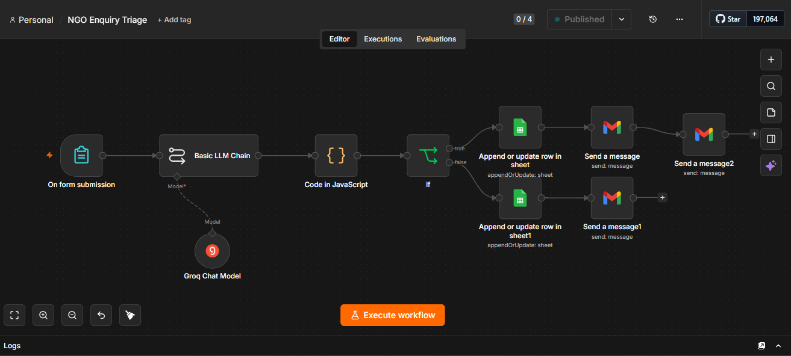
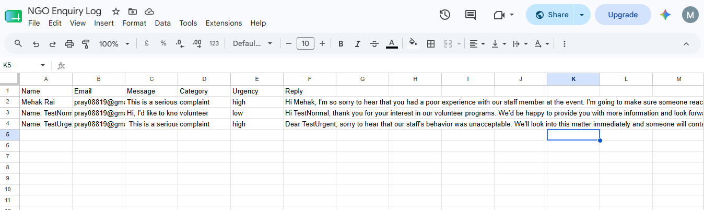
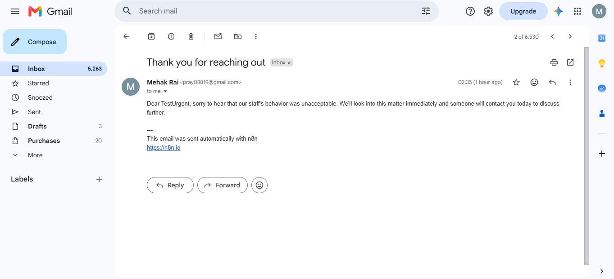

# NGO AI Enquiry Triage Automation

An AI-powered workflow built with n8n that automatically triages incoming
NGO inquiries — classifying them by type and urgency, drafting personalized
replies, logging every submission, and escalating urgent cases to staff in
real time.

## The Problem

NGOs often receive a steady mix of volunteer sign-ups, donation questions,
complaints, and media requests through a single contact channel — all
manually sorted and responded to by staff. Urgent messages (like
complaints) can get buried among routine ones, and response times suffer.

## The Solution

This workflow automatically:
1. Captures incoming inquiries through a web form
2. Uses an LLM (Llama 3.3 via Groq) to classify each message by
   **category** (volunteer / donation / complaint / media / general) and
   **urgency** (low / medium / high)
3. Drafts a short, personalized reply for the sender
4. Routes the message based on urgency
5. Logs every inquiry to a Google Sheet for tracking
6. Sends an automatic reply to the sender
7. Sends a separate real-time alert email to staff for high-urgency cases

## Workflow Diagram

Form Trigger → AI Classification (Groq) → Parse Output → Route by Urgency
→ Log to Google Sheets → Auto-Reply Email → (if urgent) Staff Alert Email

## Tools Used

- **n8n** — workflow automation platform
- **Groq API (Llama 3.3 70B)** — AI classification and reply drafting
- **Google Sheets** — inquiry log
- **Gmail** — automated email replies and staff alerts

## Screenshots

## Demo Video

[Watch the demo]https://drive.google.com/file/d/18EEoTUky3UjGqYvIru7B0rSknCM0h1az/view?usp=sharing

## What I Learned

This was my first project in n8n, built from scratch with no prior
automation experience. Along the way I learned how to:
- Chain AI model nodes with prompt engineering to get structured JSON output
- Parse and reshape data between nodes using n8n's Code node
- Build conditional branching logic (IF nodes) to route data differently
  based on content
- Debug real-world integration issues (credential/auth errors, field
  name mismatches, API rate limits)
- Connect multiple services (forms, LLMs, spreadsheets, email) into one
  working pipeline

## Why This Matters for NGOs

This kind of lightweight automation reduces response time for donors and
volunteers, ensures no inquiry is missed, and lets staff focus their
attention on urgent cases instead of manually reading every message.

## Author 

Mehak Rai
